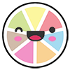
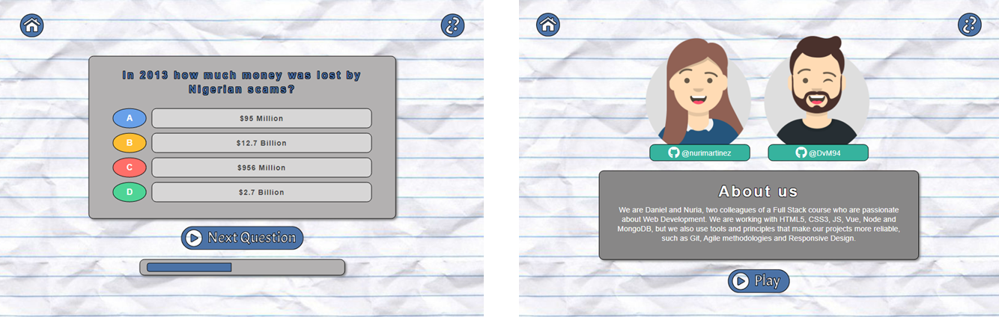

# Juego de Trivial

  

Introducción
-------------
Juego de preguntas en inglés de conocimiento general obtenidas mediante el consumo de la API Open Trivia Database. 

  

Descripción
-------------
* Aplicación con diseño responsive.
* Contador de respuestas acertadas.
* Barra de progreso según el avance del juego.
* Resultado final adaptado al número de respuestas correctas.

Setup 
-------------
* Instalar los módulos: npm install
* Arrancar la aplicación: npm run serve

Características
-------------
* HTML5
* CSS3
* JS
* SCSS
* [Node.js](https://nodejs.org/es/)
* [Trivia API](https://opentdb.com/api_config.php)
* [Vue.js](https://v3.vuejs.org/)
* [Composition API](https://v3.vuejs.org/api/composition-api.html)

Colaboración
-------------

